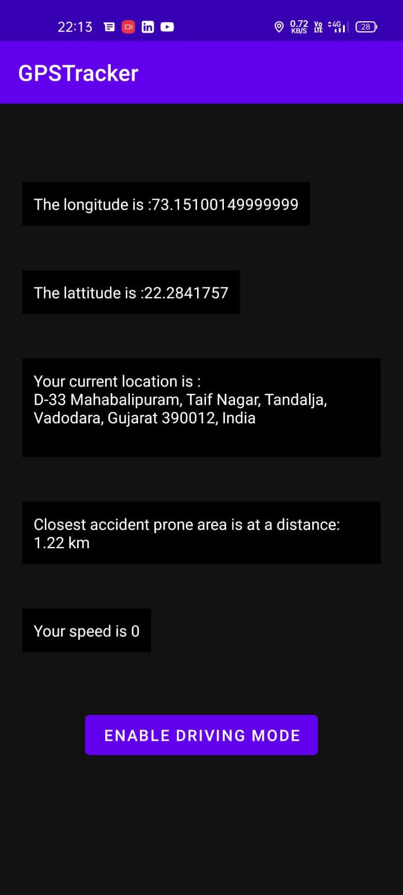

# 🚗 SafeDrive Monitor — Accident-Prone Zone Detection & Alert

<div align="center">


*A driving safety companion that warns you before you reach a known accident-prone area.*

</div>

## Overview

SafeDrive Monitor is an Android app that tracks your location in the background, measures the
distance to accident-prone areas you have marked, and escalates through visual, audible, spoken,
and haptic alerts as you approach one. It also records trip statistics and can send an SOS with
your live location to emergency contacts.

<p align="center">

</p>

## Features

### Live monitoring
- Foreground location service with a persistent notification
- Distance to the nearest danger zone, updated every 5 seconds
- Live speed readout in km/h
- Colour-coded status banner: **Safe** (green) → **Approaching** (amber, within 3 km) →
  **Accident-Prone Zone** (red, within 1.5 km)
- Reverse-geocoded street address, resolved off the main thread

### Alerts
- Audible alert tone on entering a zone
- Spoken warning via Text-to-Speech, naming the zone
- Vibration
- Alerts are rate-limited to once per minute so they do not become noise

### Driving mode (device admin)
When enabled, the screen locks 10 seconds after you enter a danger zone, discouraging phone use
at the moments that matter most. Requires device administrator permission, which you can revoke
at any time from within the app.

### Emergency SOS
One tap on the SOS button sends an SMS to every saved emergency contact containing your
coordinates and a Google Maps link. A confirmation dialog prevents accidental sends.

### Emergency contacts
Add, call, and delete personal contacts, stored on-device. Police / ambulance / fire buttons open
your dialer with the number pre-filled — deliberately *not* an automatic call, so a stray tap
cannot dial emergency services.

### Danger zone management
Add zones from your current GPS position or by entering coordinates manually, and delete them.
Coordinates are validated before saving. Two sample zones ship on first launch.

### Trip analytics
Trips start automatically above 10 km/h and end after two minutes stationary. The app records:

| Metric | Notes |
|---|---|
| Total trips | Completed trips |
| Distance | Cumulative km |
| Average / max speed | Across all trips |
| Speeding violations | One per crossing above 80 km/h |
| Safety score | 100 minus penalties for speeding and danger-zone entries |
| Activity timeline | Last 50 events (trips, zone entries, violations, SOS) |

History can be cleared from the analytics screen.

## Technical Stack

- **Language**: Java, `minSdk 21`, `targetSdk 34`
- **UI**: Material Design 3, light and dark themes
- **Location**: Google Play Services `FusedLocationProviderClient`
- **Persistence**: SharedPreferences with JSON payloads (no external database)
- **Alerts**: `TextToSpeech`, `MediaPlayer`, `Vibrator`
- **Screen lock**: `DevicePolicyManager` via a `DeviceAdminReceiver`

## Permissions

| Permission | Why |
|---|---|
| `ACCESS_FINE_LOCATION` / `ACCESS_COARSE_LOCATION` | Core zone detection |
| `ACCESS_BACKGROUND_LOCATION` | Monitoring while the app is not in front |
| `FOREGROUND_SERVICE` / `FOREGROUND_SERVICE_LOCATION` | The tracking service |
| `POST_NOTIFICATIONS` | Service notification on Android 13+ |
| `SEND_SMS` | SOS messages |
| `CALL_PHONE` | Calling a saved contact (falls back to the dialer if denied) |
| `VIBRATE` | Haptic alerts |
| Device administrator | Screen lock in driving mode (opt-in) |

## Build & Run

```bash
./gradlew :app:assembleDebug
```

Install on a connected device or emulator:

```bash
adb install -r app/build/outputs/apk/debug/app-debug.apk
```

Requires JDK 17+ and the Android SDK (platform 34). Emergency service numbers default to Indian
codes (100 / 108 / 101) and are defined in `app/src/main/res/values/strings.xml` — change them
for your region.

## The `Model/` directory

`Model/` holds a **standalone Python prototype** for vision-based accident detection from video
(OpenCV + a Keras classifier + optional YOLO). It is research code and is **not connected to the
Android app** — the app performs no on-device video inference. The trained weights
(`accident_detection_model.h5`, YOLO `.weights`) are not included in this repository, so the
scripts will not run until you supply your own.

```bash
pip install -r Model/requirements.txt
python Model/enhanced_accident_detection.py   # needs model weights
```

## Known limitations

- Danger zones are entered manually; there is no crowd-sourced or municipal data feed.
- Detection is purely geofence-based — the app does not detect a crash from sensors.
- SOS delivery depends on carrier SMS; there is no delivery receipt or fallback channel.
- Statistics live in SharedPreferences and are lost if app data is cleared.

## Roadmap

- Map view with zone overlays and long-press to add
- Crash detection from accelerometer data
- Sensor-triggered automatic SOS with a countdown to cancel
- Room database and trip-by-trip history
- Importing accident hotspot datasets

## License

MIT
